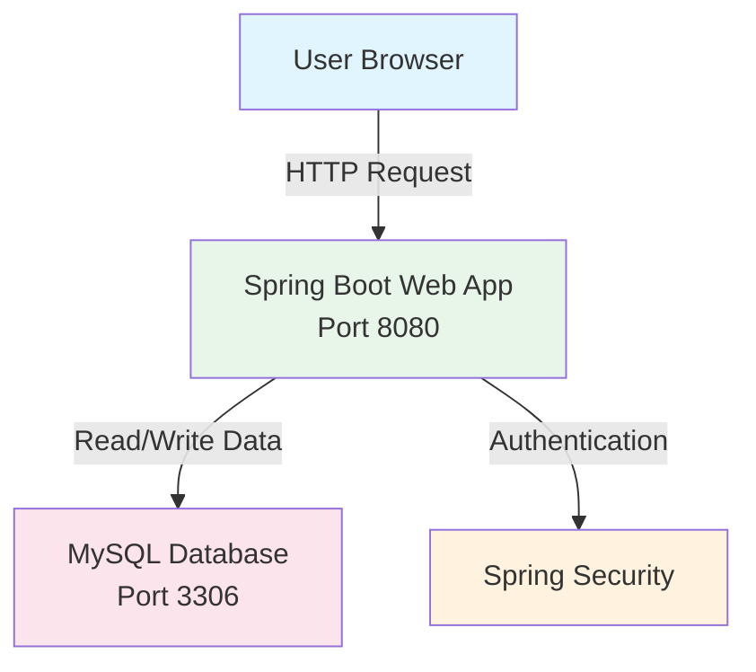

# Expenses Tracker Web App - 3-Tier Docker Architecture

A full-stack expense management application built with Spring Boot, Thymeleaf, MySQL, and Docker, and deployed on Amazon EC2.

## Architecture Overview



**Workflow Description:**
1. **Presentation Layer**: Users access the application through their browser.
2. **Application Layer**: Spring Boot handles the web requests and business logic.
3. **Security Layer**: Spring Security manages login, authentication, and protected routes.
4. **Data Layer**: MySQL stores and retrieves expense tracking data.

## Requirements

### AWS EC2 Setup
- **Instance Type**: t2.medium or larger
- **Operating System**: Ubuntu 22.04 LTS
- **Security Group**: Open ports 22 (SSH) and 8080 (HTTP)
- **Storage**: Minimum 20GB

### Software Prerequisites
- Java 17
- Maven
- Docker
- Docker Compose
- Git

## Installation & Deployment

### 1. SSH into AWS EC2 Instance
```bash
ssh -i your-key.pem ubuntu@<EC2_PUBLIC_IP>
```

### 2. Update System and Install Docker
```bash
sudo apt-get update
sudo apt-get install docker.io
sudo apt-get install docker-compose-v2
sudo usermod -aG docker $USER
newgrp docker
```

### 3. Clone the Repository
```bash
git clone https://github.com/Ibrahim-Naseef/Expense-Tracker-App-Docker.git
cd Expense-Tracker-App-Docker
```

### 4. Build and Run with Docker Compose
```bash
docker-compose up -d
```

### 5. Verify the Deployment
```bash
docker ps
curl http://localhost:8080
```

Once deployed, open the application using your EC2 public IP:
```text
http://<EC2_PUBLIC_IP>:8080
```

## Application Structure

### Web Application
- **Location**: ./src/main/java
- **Port**: 8080
- **Role**: Handles controllers, services, security, and business logic

### User Interface
- **Location**: ./src/main/resources/templates
- **Role**: Thymeleaf pages for login, registration, expense management, and updates

### Database
- **Type**: MySQL
- **Port**: 3306
- **Role**: Stores users, expenses, categories, clients, and roles

## Features
- User registration and login
- Secure authentication and protected routes
- Add, edit, view, and delete expenses
- Filter expenses by category or criteria
- MySQL-backed persistence
- Docker-based deployment

## Docker Commands

```bash
# View running containers
docker ps

# View container logs
docker-compose logs -f

# Stop all services
docker-compose down

# Rebuild and restart
docke-compose up -d --build
```

## AWS Security Best Practices

1. **Security Group Configuration**
   - Allow SSH (22) only from your trusted IP
   - Allow HTTP (8080) only for the required access level
   - Consider adding HTTPS later with Nginx or a load balancer

2. **Database Security**
   - Use strong passwords
   - Keep credentials out of source code

3. **Backup & Recovery**
   - Regularly back up the MySQL data volume

## Troubleshooting

### Container fails to start
```bash
docker compose logs
```

### Database connection error
- Verify that the MySQL container is running
- Check the database credentials in the application configuration

### Port already in use
```bash
sudo lsof -i :8080
sudo kill -9 <PID>
```

## Useful Resources

- [Docker Documentation](https://docs.docker.com/)
- [Spring Boot Documentation](https://spring.io/projects/spring-boot)
- [MySQL Documentation](https://dev.mysql.com/doc/)
- [AWS EC2 Guide](https://docs.aws.amazon.com/ec2/)

